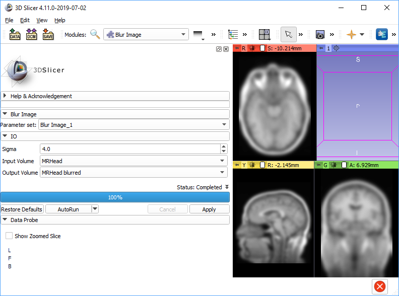

# SlicerPythonCLIExample
Example extension for 3D Slicer that demonstrates how to make a Python script available as a CLI module

BlurImage module is a simple Python script, which is made available in Slicer as a CLI module (with auto-generated GUI) just by adding a description of input and output parameters in a [Slicer Execution Model XML file](https://www.slicer.org/wiki/Documentation/Nightly/Developers/SlicerExecutionModel).

Once `BlurImage` folder is added to additional module paths (or the extension package is installed), "Blur Image" module will show up in the module list (in Filtering / Denoising category) and can be used in Slicer as any other module.



The script can be executed from any other module, the same way as other CLI modules. Example:

```python
import SampleData
inputImage = SampleData.downloadSample('MRHead')
outputImage = slicer.mrmlScene.AddNewNodeByClass('vtkMRMLScalarVolumeNode', inputImage.GetName()+' blurred')

param = {}
param["inputVolume"] = inputImage.GetID()
param["outputVolume"] = outputImage.GetID()
param["sigma"] = 3.0
slicer.cli.runSync(slicer.modules.blurimage, parameters=param)
```
